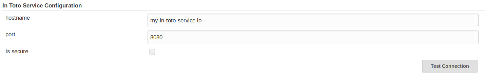

in-toto Jenkins
===============

This repository contains the source code for the in-toto provenance plugin for
Jenkins.

## Installation

You can compile the plugin by running `mvn package` (note, make sure
you have the [in-toto-java jar available](https://github.com/controlplaneio/in-toto-java).
and manually install the `.hpi` file in your Jenkins installation.

We intend to move this to the plugin site for Jenkins once a more mature
implementation is reached.

### Configuration of in-toto service:

The only transporter supported at this moment is the in-toto service transporter. This should
be configured in `Configure System` under `Manage Jenkins`.




## Usage in free-style projects

This plugin exposes a "post build" entry in the task menu. When selecting it
you will be prompted to fill the following information in:

- stepName: the name of the step for this Jenkins pipeline (more on that later)
- privateKeyCredentialId: Id of File Credential as the signing key used to sign the link metadata.
- supplyChainId: Id of the supplychain on the configured in-toto service.

Once this is done, the plugin will take care of generating and tracking
information of the build process.

## Usage in declarative pipelines

You can also use it in declarative pipelines by using the `in_toto_wrap`
syntax. It takes the same arguments as before. For example, to wrap a simple
shellscript step you would add the following to your Jenkinisfile:

```

pipeline {
    agent any
    stages {
        stage('Clean') {
            steps {
                withDockerContainer(image: maven) {
                    mvn 'clean'
                }
            }
        }
        stage('Build') {
            steps {
                in_toto_wrap(['stepName': 'build',
                              'privateKeyCredentialId': 'bob',
                              'supplyChainId': 'Supplychains/domain1/app1/petclinic'])
                {
                    withDockerContainer(image: maven) {
                        mvn 'install deploy'
                    }
                }
            }
        }
        stage('Sonar') {
            steps {
                in_toto_wrap(['stepName': 'sonar',
                              'privateKeyCredentialId': 'bob',
                              'supplyChainId': 'Supplychains/domain1/app1/petclinic'])
                {
                    withDockerContainer(image: maven) {
                        mvn 'sonar:sonar -Dsonar.host.url=http://my-sonar-server.io'
                    }
                }
            }
        }
    }
}
```

This will produce a piece of link metadata and post it to the configured in-toto service.

## Limitations

As of now, the current limitations exist:

- If using the credentialId, the metadata will be signed in master.
