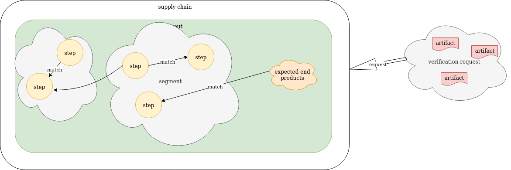
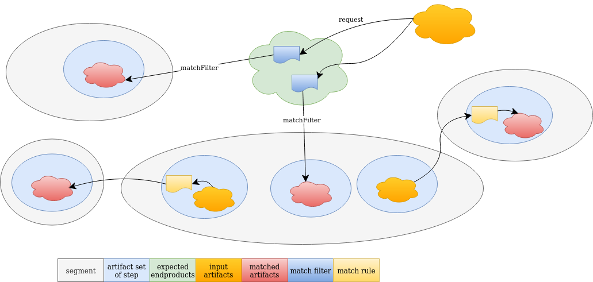
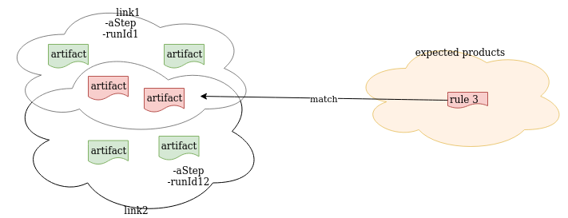

# Verification of the Supply Chain End Products

## Start State

1. There is a SupplyChain defined
2. There are 1 or more active and valid Layouts
    1. The Layouts have only 1 segment
3. A verification request is done with a set of Artifacts
4. The Layouts have a list of expectedEndProducts.
5. The expectedEndProducts are from 1 segment
6. There is a directed graph from the segment with the steps with the expected end products.

### Verify the Artifacts on the request



An example of a `SupplyChain` with a `Layout`



An example of a use case of a `Layout` with several `Segments`

---
Every Layout is processed until one of them has a valid result.

```
    processLayouts
        artifacts = request.artifacts
        for every Layout
            matchFilters = layout.matchFilters
            resolvedSegments, linkSets = processMatchFilters(matchFilters, endProducts)
            resolvedSegments, linkSets = processMatchRules(resolvedSegments, linkSets)
            verificationContexts = createVerificationContexts(layout, linkSets)
            for context in verificationContexts
                result = processVerification(context)
                if result is valid
                    return valid
        return invalid
```
---
The goal of `processMatchFilters` is to get sets of Link objects of the layout segments which have matched artifacts based on the `matchFilters` in the expected end products and the `artifacts` in the verification request. The validation will proof which of these different sets has delivered a valid end product.

The clients should set a runId which is as unique as possible. This runId is used to get all Link objects for steps which aren't a destination of a match filter or rule made during a run.

```
    processMatchFilters(matchFilters, artifacts)
        map = {}
        map = filter(matchFilters, artifacts)
        return getLinks(destSegment, map, [[]])
                
    filter(matchFilters, artifacts)
        map = {}
        for filter in matchFilters
            map[filter.destStep] = { "destType": filter.destType, artifacts: match(filter.pattern, artifacts)}
        return map
```
1. It is possible that the same end products are available in more than 1 different run of the supply chain with different runId's. For example if the run is only different in a disjunct part of all end products or if runs are not complete. Every runId with it's run should be checked on validity.



---
The next phase `processMatchRules` gets the not resolved upstream segments based on the `matchRules`

```
    processMatchRules(resolvedSegments, linkSets)
        map = {} // map with srcSegment, srcStep, matchRules
        destSegment, map = getSegmentStepsWithMatchRules(resolvedSegments)
        resolvedSegments.add(destSegment)
        if no matchRules
            return resolvedSegments, linkSets
        for linkSet in linkSets
            stepMap = filter(map, linkSet)
            linkSets = getLinks(segment, map, linkSets)
        return processMatchRules(resolvedSegments, linkSets)
                
    filter(map, linkSet)
        stepMap = {}
        for segment in map
            for step in segment
                for rule in matchRules
                    stepMap[filter.destStep] = { "destType": rule.destType, artifacts: match(rule.pattern, linkSet.segment.step.type.artifacts)}
        return stepMap
            
    getSegmentStepsWithMatchRules(resolvedSegments)
        map = group matchRules in resolvedSegments by destination segment not resolved, destination step and destType
        return first segment and map with destSteps, destTypes and matchrules entries
```
---
Some helper functions 

```
    getLinks(segment, map, linkSets)
        resolvedSteps = []
        // get links of dest steps in segment
        links = []
        for step in map
            links.add(query(segment, step))
            resolvedSteps.add(step)
                
            // get the other steps with the runIds
            runIds = findRunIds(links)
            newLinkSets = linkSets
            for runId in runIds
                runIdLinks = links
                runIdLinks.add(query(runId, segment, resolvedSteps))
                newLinkSets = permutate(runIdLinks, newLinkSets)
            return newLinkSets
            
    permutate(links, linkSets)
        temp = []
        stepSets = group links by step and links.hashCode
        for linkSet in linkSets
            for step in stepSets
                for stepLinkSet in step
                    temp.add(linkSet.add(stepLinkSet))
        return temp
                    
    query(segment, step)
        return query in database links with segment and step and step.artifacts
              
    query(runId, segment, resolvedSteps)
        return query in database links with runId and segment and not in resolvedSteps
```


---

After all posible sets of links are created these are used to create verification contexts which are used to do the rest of the verification.


```
    processVerification(verificationContext)
        LAYOUT_AUTHORIZED_KEYID
            verifies if the layout is signed with authorized keys 
        LAYOUT_METABLOCK_SIGNATURE
            verifies if layout has a valid signature        
        BUILDSTEPS_COMPLETED
            verifies if every step has at least some link objects
        STEP_AUTHORIZED_KEYID
            verifies if every link on every step is signed with authorized keys
        LINK_METABLOCK_SIGNATURE
            verifies if every link on every step has a valid signature
        EXPECTED_COMMAND
            verifies if the used command on every link on every step is as expected
        RULES
            processes all rules on every step
        REQUIRED_NUMBER_OF_LINKS
            verifies if the the number of links on every step reaches the required number
```
        
    
    

